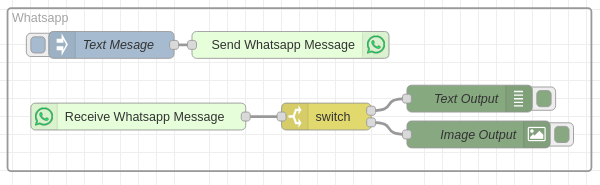
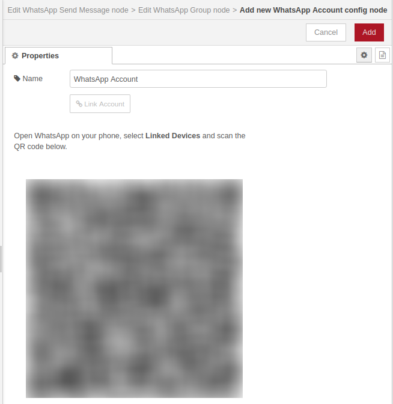
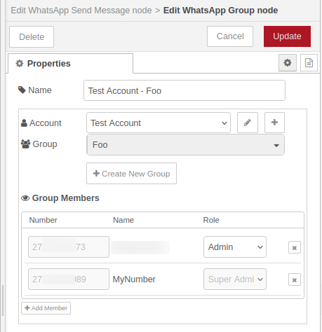
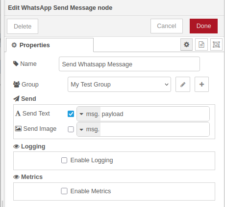
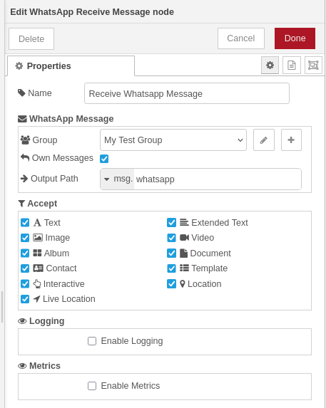

# @theotherwillembotha/node-red-whatsapp

Node-RED nodes for WhatsApp messaging via the [Baileys](https://github.com/WhiskeySockets/Baileys) library. Supports sending and receiving messages to/from WhatsApp groups, with persistent session management and per-message-type filtering.

---

> [!WARNING]
> **This package is in early development.** Many features may be incomplete, unstable, or behave unexpectedly. A significant amount of diagnostic information is currently printed to the Node-RED console — this is intentional while the package matures and will be reduced in future releases. Use with caution in production environments.

---

> [!IMPORTANT]
> **This plugin requires [`@theotherwillembotha/node-red-plugincore`](https://github.com/theotherwillembotha/nodered_plugincore) to be installed.**
>
> `node-red-plugincore` is declared as a dependency and npm will install it automatically alongside this package. However, due to a [known Node-RED limitation](https://github.com/node-red/node-red/issues/3529), packages that arrive as transitive npm dependencies are only discovered by the Node-RED runtime on the **next startup**.
>
> **You have two options:**
> - Install [`@theotherwillembotha/node-red-plugincore`](https://flows.nodered.org/node/@theotherwillembotha/node-red-plugincore) via the palette manager or `npm install` **first**, then install this plugin — both will be available immediately without a restart.
> - Install this plugin directly — `node-red-plugincore` will be installed automatically alongside it. **Restart Node-RED** once and both packages will be fully loaded.

---

## Prerequisites

- Node.js >= 18
- Node-RED >= 4.0.0
- A WhatsApp account that can be linked via QR code (WhatsApp Web / Linked Devices)

## Installation

Either use the **Manage Palette** option in the Node-RED editor, or run the following in your Node-RED user directory (typically `~/.node-red`):

```bash
npm install @theotherwillembotha/node-red-whatsapp
```

---

## Nodes



---

### WhatsApp Account (config node)

Manages a WhatsApp Web session. Handles QR-code pairing and persists session credentials to disk so the connection survives Node-RED restarts.



| Property | Description |
|----------|-------------|
| *name* | Display label for this account |

**Linking an account** — open the node editor and click **Link Account**. A QR code is displayed; scan it with WhatsApp on your phone (Linked Devices). Once scanned, the session is saved and reconnected automatically on each restart. To unlink, click **Unlink Account** and remove the linked device from WhatsApp on your phone.

---

### WhatsApp Group (config node)

References a WhatsApp group within a linked account. Used as the target for Send Message nodes and the source for Receive Message nodes.



| Property | Description |
|----------|-------------|
| *name*    | Display label for this config node |
| *account* | The WhatsApp Account config node that owns this group |
| *group*   | The WhatsApp group to use — populated from groups available on the selected account |

Click **Create New Group** to create a new WhatsApp group directly from Node-RED.

---

### WhatsApp Send Message

Sends a message to a WhatsApp group when triggered by an incoming Node-RED message.



| Property | Description |
|----------|-------------|
| *name*  | Display label |
| *group* | The WhatsApp Group config node to send to |

**Send fields** — each field has an enable checkbox and a typed value. Enable the fields you want to send on each trigger:

| Field | Supported types |
|-------|----------------|
| Send Text  | `msg`, `flow`, `global`, `str` |
| Send Image | `msg`, `flow`, `global` |

The node resolves each enabled field's value against the incoming message (for `msg` type) or from context, then sends to the group.

---

### WhatsApp Receive Message

Outputs a Node-RED message for each incoming WhatsApp message in a group.



| Property | Description |
|----------|-------------|
| *name*         | Display label |
| *group*        | The WhatsApp Group config node to listen on |
| *own messages* | Whether to forward messages sent by this account |
| *output path*  | Where in the output `msg` to place the WhatsApp message (or which `flow`/`global` context variable to write to) |

**Accept filters** — each message type can be individually enabled or disabled. Enabled by default: Text, Extended Text, Image, Video, Album. Available types: Text, Extended Text, Image, Video, Album, Document, Contact, Template, Interactive, Location, Live Location.

**Output message** — the WhatsApp message object is placed at the configured output path (default: `msg.payload`). The object includes:

| Field | Description |
|-------|-------------|
| `messageId`  | WhatsApp message ID |
| `timestamp`  | Unix timestamp (seconds) |
| `chat.id`    | Group JID |
| `chat.name`  | Group display name |
| `sender.id`  | Sender JID |
| `sender.name`| Sender display name |
| `sender.me`  | `true` if sent by this account |
| `type`       | Message type (e.g. `Text`, `Image`, `Location`) |
| `payload`    | Type-specific content (text, image buffer, coordinates, etc.) |

---

## Data storage

Session credentials and the SQLite message store are written to `/data/whatsapp/` if the `/data` directory exists (standard Node-RED Docker image), otherwise to `./whatsapp/` relative to the Node-RED working directory.

---

## Part of the node-red-plugincore ecosystem

| Package | Description |
|---------|-------------|
| [node-red-plugincore](https://www.npmjs.com/package/@theotherwillembotha/node-red-plugincore) | Core framework |
| [node-red-telemetry](https://www.npmjs.com/package/@theotherwillembotha/node-red-telemetry) | Structured logging & Prometheus metrics |
| [node-red-loki](https://www.npmjs.com/package/@theotherwillembotha/node-red-loki) | Grafana Loki log transport |
| [node-red-circuitbreaker](https://www.npmjs.com/package/@theotherwillembotha/node-red-circuitbreaker) | Circuit breaker fault tolerance |
| [node-red-zookeeper](https://www.npmjs.com/package/@theotherwillembotha/node-red-zookeeper) | Apache ZooKeeper integration |
| [node-red-whatsapp](https://www.npmjs.com/package/@theotherwillembotha/node-red-whatsapp) | WhatsApp messaging (this package) |

## License

[ISC](LICENSE)
